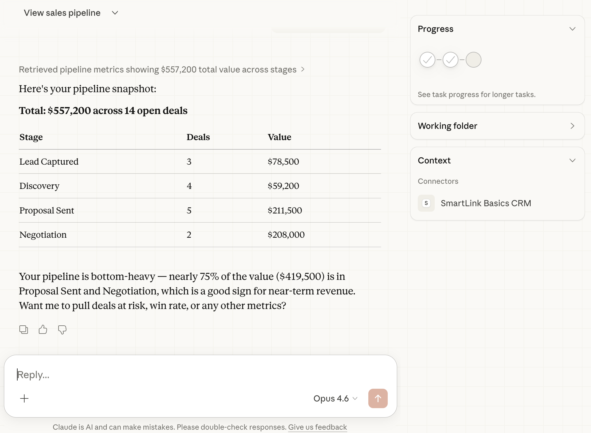
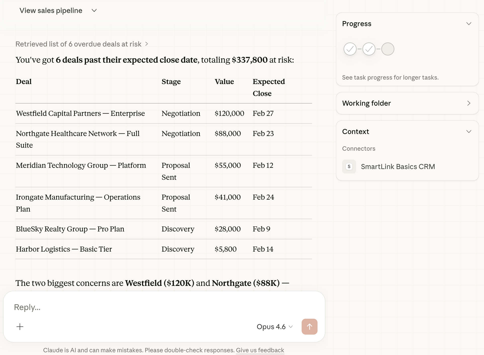
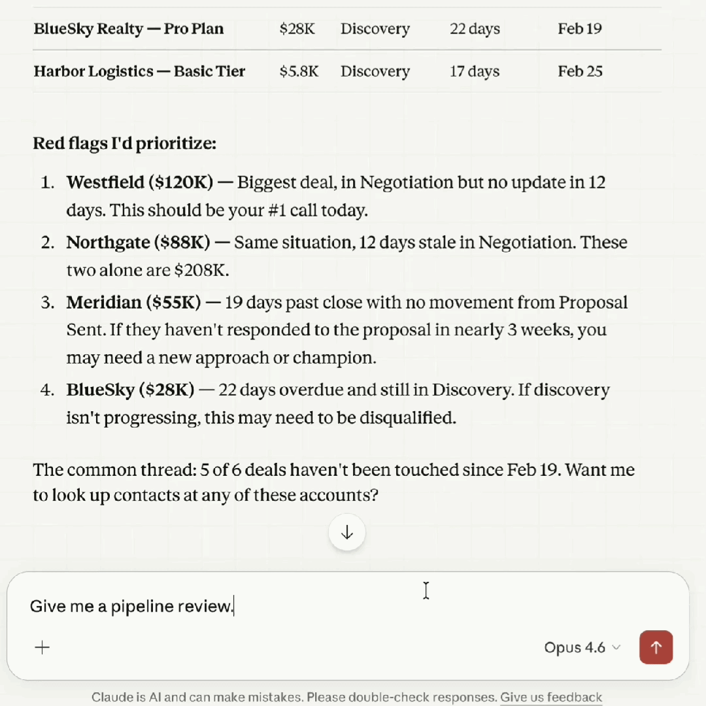

# SmartLink Basics — Claude Cowork Plugin

Sales CRM tools powered by the SmartLink Basics 6-KPI framework. Built by a sales leader, not a vendor.

## What This Plugin Does

Connects Claude to your SmartLink Basics CRM and gives it the sales coaching methodology to interpret your data — not just report it. When you ask "how's my pipeline?", Claude doesn't dump a spreadsheet. It tells you what needs attention this week and what to coach on.

Built on the **"inspect what you expect"** framework: focus on the 6 metrics that actually drive decisions, and coach your team on what moves deals forward.

## Skills

| Skill | What It Does |
|-------|-------------|
| Pipeline Review | Pulls all 6 KPIs and generates a leadership-ready pipeline brief |
| Deal Check | Analyzes specific deals for risk — timeline, activity, velocity |
| Coaching Prep | Prepares 1:1 coaching talking points for a rep with data-backed recommendations |
| Forecast | Assesses forecast confidence with the math to back it up |
| Sales Coaching | The "inspect what you expect" methodology and coaching principles |
| KPI Analysis | How to pull, contextualize, and present metrics with benchmarks |

## The 6 Core KPIs

Every skill is built around these metrics:

1. **Pipeline Value** — How much is in play and where it sits
2. **Win Rate** — How efficiently you convert opportunities
3. **Deal Velocity** — How fast deals move from creation to close
4. **Activity Rate** — Whether reps are doing enough of the right activities
5. **Stage Conversion** — Where deals die in the funnel
6. **Forecast vs Actual** — Whether the team can predict their own performance

## See It In Action

### Pipeline Overview

### Deals at Risk

### Pipeline Review Demo

## Requirements

- A SmartLink Basics CRM account (Growth or Pro tier)
- Claude Pro, Max, Team, or Enterprise plan

## Setup

Install the plugin and the included MCP server connects to your SmartLink Basics CRM automatically. On first use, you'll authenticate with your SmartLink Basics account.

## Quick Start

Once installed, try:

- "Show me my pipeline" — Claude pulls your deal data and breaks it down by stage
- "How's my pipeline?" — Get a full 6-KPI leadership brief
- "Which deals are at risk?" — Surfaces overdue and stale deals
- "Prep for my 1:1 with Sarah" — Data-backed coaching talking points
- "Will we hit our number?" — Forecast confidence assessment

## About SmartLink Basics

SmartLink Basics equips sales leaders with clear dashboards, practical playbooks, and AI automations that replace complexity with results. We align teams around the few metrics that matter, streamline workflows, and accelerate revenue.

**Software Is the Service.** We're operators who build tools, not vendors selling platforms.

- Website: [smartlinkbasics.com](https://smartlinkbasics.com)
- CRM: [crm.smartlinkbasics.com](https://crm.smartlinkbasics.com)
- Support: support@smartlinkbasics.com

## License

MIT
